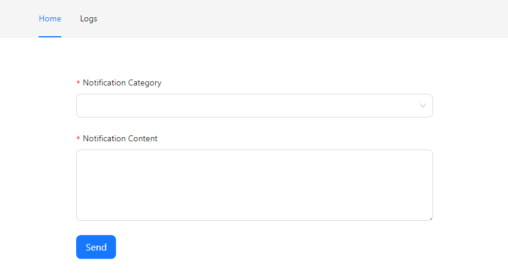
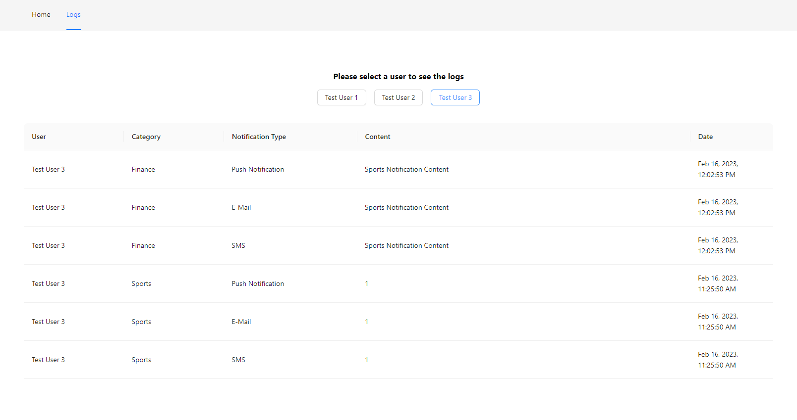

## Gila Software Test

This repository holds the technical test for **Gila Software**, based on specifications provided on this [file](./docs/Coding Challenge  NT.pdf).

## TL;DR;
Run the project with ```docker-compose up``` (Needs Docker and docker-compose installed)

## Design Decisions

### Backend
For the backend, I chose **Nest JS** framework to bootstrap the application for the following reasons:
* Fast
* Opinionated
* Works great with serverless and dedicated server architectures
* Out-of-the-box modularity

**TypeORM** was chosen as the ORM since it provides seamless connection, fast development time, and well-typed entities.
It also provides migrations out-of-the-box (which were not used since Docker handled the database code) but is a nice feature if the project gets big.

**Class interfaces and the Strategy pattern** were used to support changes in the system, allowing for new notification services to be implemented fast without much maintenance.

Try ```yarn test``` or ```npm test``` to run unit tests.  
Try ```yarn test:e2e``` or ```npm run test:e2e``` to run e2e tests.

### Frontend
For the frontend, I chose **ReactJS** for simplicity. It is a well-known frontend framework used extensively on production in many applications. It manages state well, is easy to use, and is easy to maintain.

I'm using a couple of libraries to manage common needs; they are described as follows:
* **Ant Design**
  * Component library. A lot of well-styled resources working out of the box. It provides some flexibility while making you blazing fast on UI design. Also really easy to make things responsive.
* **React-Redux Toolkit**
  * State management library. The ability to manage states in a centralized way, provides easy connection to external APIs while also taking care of retry policies, caching, and a friendly interface for loading states and error handling.
* **Typescript**
  * Not much to say here. I like the safeguards that the type system provides. Sure, it can take more time to develop, so it's a design decision, nothing wrong with plain Javascript.

Try ```yarn test``` or ```npm test``` to run unit tests.

### Database
**PostgreSQL** was chosen as the database for this application for the following reasons:
* Fast to develop
* Information was coupled enough to justify the SQL approach
* Plays well with TypeORM
* Easy to setup on Docker
* Well used in production on highly scalable applications
* Syntax could be reused in case of migrating to AWS Aurora, CockroachDB, or some similar services on the cloud

### Infrastructure
**Docker** was used to glue all of this together. There is not much to say here other than that it makes the application easy to run in this case.

## Screens
### Home



### Logs


## Testing Scenarios

### Automated tests
There are a couple of tests (unit and integration) on the frontend and the backend just to show that I had contact with those tools, but I didn't focused much on that.

### Manual testing

The application has three notification categories: ```['Sports', 'Finance', 'Movies']```
You must select a category, fill in the notification content in the text area, and hit send.

The application also has 3 test users with the following configuration:
* ```Test User 1```
  * Subscribed to categories: ```['Sports']```
  * Subscribed to channels: ```['SMS']```
* ```Test User 2```
  * Subscribed to categories: ```['Finance', 'Movies']```
  * Subscribed to channels: ```['E-Mail', 'Push Notification']```
* ```Test User 3```
  * Subscribed to categories: ```['Sports', 'Finance', 'Movies']```
  * Subscribed to channels: ```['SMS', 'E-Mail', 'Push Notification']```
